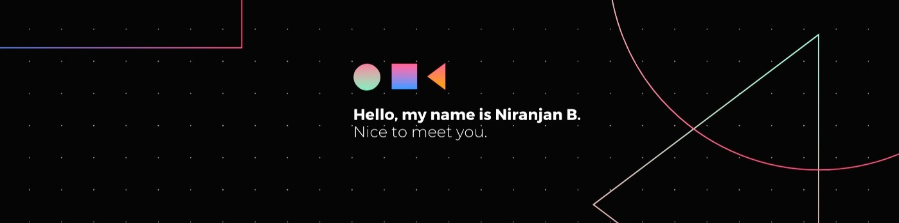

## Hey Folks,

I am a Software Developer/Backend Developer, I am from Kerala, India.

### Where to find me

                

### Articles

<ul>
<li><a href="https://medium.com/@niranjannb7777/binary-huffman-encoding-91b1884edc05?source=rss-7fc07edd0058------2" target="_blank">Binary Huffman Encoding</a></li>
</ul>

### Contributions

|||
| ------------- | ------------- |
|  |   |

  

___

Last Updated on 03 September 2023

